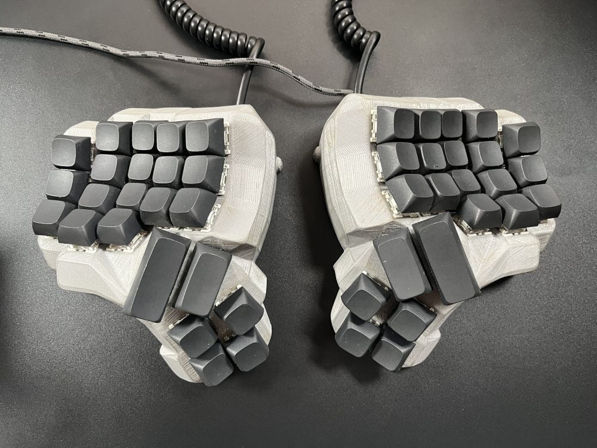

# Vial firmware for the handwired 4x5 Dactyl Manuform

### To be inserted into `~/vial-qmk/keyboards/handwired/dactyl_manuform/4x5/`

The following Vial features were disabled in `rules.mk` to reduce firmware size and make it fit on the Pro Micro:  
REPEAT_KEY_ENABLE  = no  
KEY_OVERRIDE_ENABLE = no  
COMBO_ENABLE = no  

A precompiled `.hex` firmware is also available. If you don’t need to modify the QMK code, you can flash this file directly using QMK Toolbox.

### QMK Layouts

The following layout is supported:  
| Layout | Diagram |
| :---: | :---: |
| Split_3x5_3 |  |
